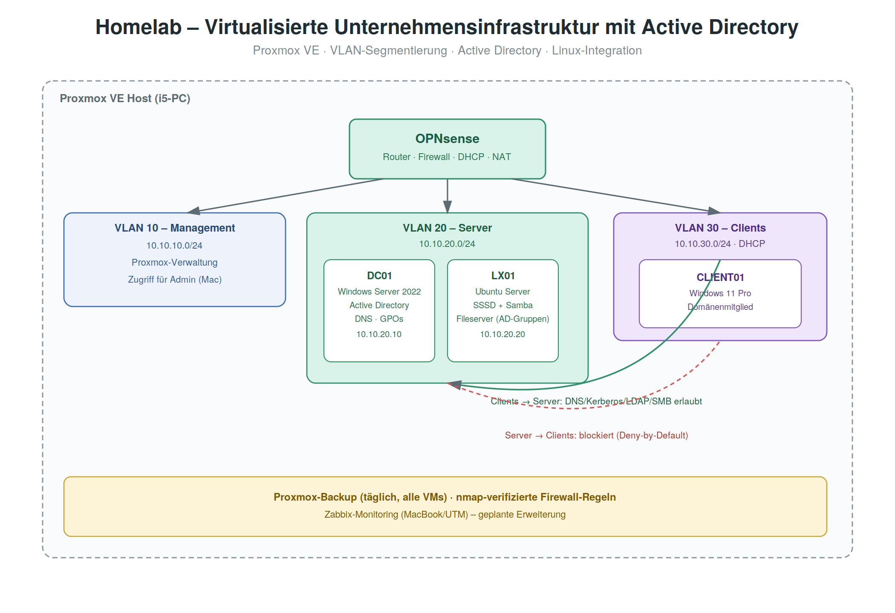
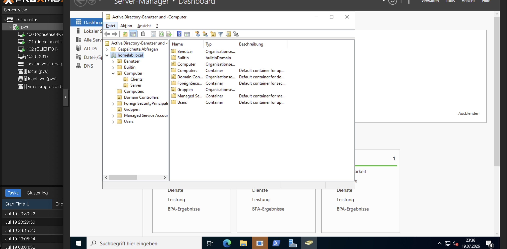
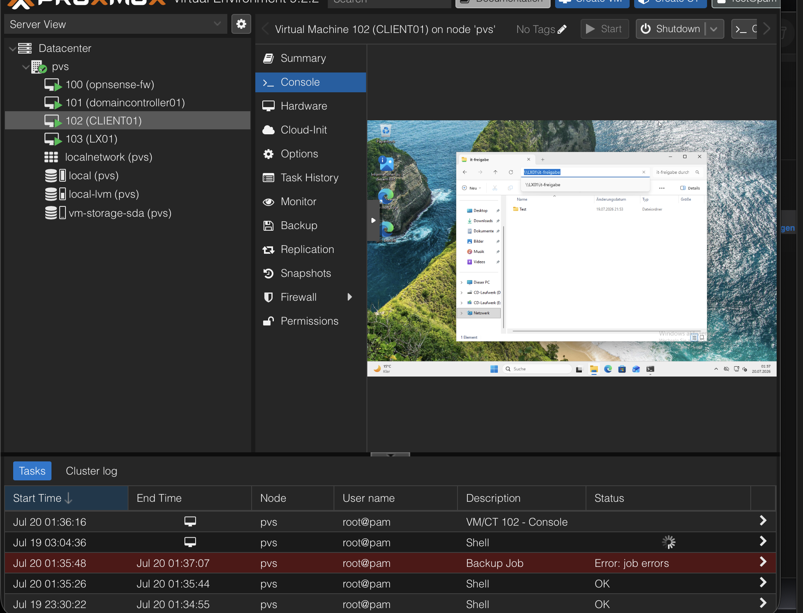
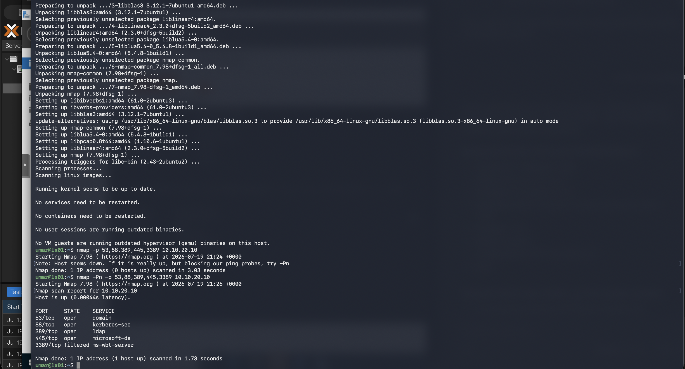
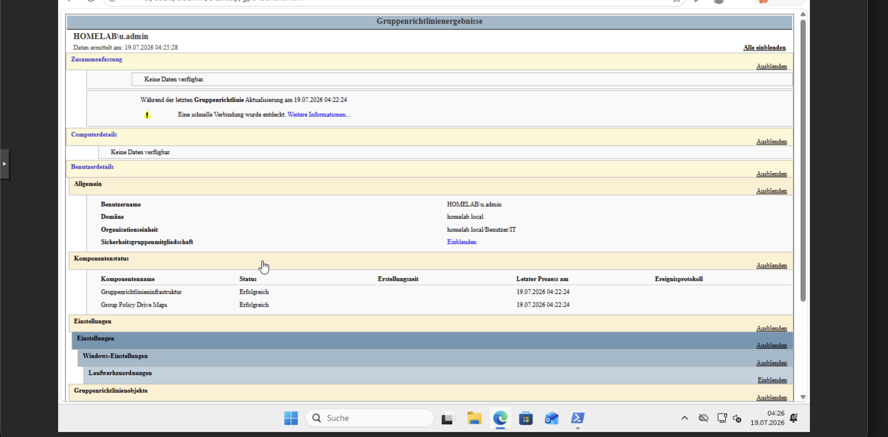

# 🏢 Homelab: Virtualisierte Unternehmensinfrastruktur mit Active Directory

Aufbau eines segmentierten Firmennetzwerks auf Proxmox-Basis mit
Active-Directory-Domänenstruktur, Gruppenrichtlinien und einem
domänenintegrierten Linux-Fileserver – der Fokus liegt bewusst auf
klassischer IT-Systemadministration.

> Privates Lernprojekt | Proxmox VE, OPNsense, Windows Server 2022, Ubuntu Server

## 📌 Ausgangslage & Ziel

Ziel war der Aufbau einer realistischen kleinen Firmennetzwerk-Umgebung,
die die Kernkompetenzen klassischer Systemadministration abdeckt – als
Ergänzung zu meinen ersten beiden Portfolio-Projekten (Docker/RAG und
n8n-Automatisierung), die eher Linux- bzw. API-lastig waren.

**Ziele:**
- Netzwerksegmentierung mit VLANs und einer eigenen Firewall/Router-VM
- Active-Directory-Domäne mit strukturierten Organisationseinheiten
- Gruppenrichtlinien für Passwort-, Sicherheits- und Laufwerksrichtlinien
- Ein Linux-Server, der sich gegen Windows-AD authentifiziert und als
  Fileserver mit AD-Berechtigungen arbeitet
- Verifizierte Firewall-Regeln und eine funktionierende Backup-Strategie

## 🏗️ Architektur



| VLAN | Zweck | Subnetz |
|---|---|---|
| 10 – Management | Proxmox-Verwaltung | 10.10.10.0/24 |
| 20 – Server | Domain Controller, Linux-Fileserver | 10.10.20.0/24 |
| 30 – Clients | Windows-Arbeitsplätze (DHCP) | 10.10.30.0/24 |

**Komponenten:**

| VM | Rolle |
|---|---|
| **OPNsense** | Router, Firewall, DHCP, NAT zwischen den VLANs |
| **DC01** (Windows Server 2022) | Active Directory, DNS, Gruppenrichtlinien |
| **LX01** (Ubuntu Server) | Domänenintegrierter Fileserver (SSSD + Samba/winbind) |
| **CLIENT01** (Windows 11 Pro) | Domänen-Client zum Testen von Anmeldung & GPOs |

## 🔐 Active Directory & Berechtigungskonzept (AGDLP)

Benutzer und Gruppen folgen dem AGDLP-Prinzip (Accounts → Global Groups →
Domain Local Groups → Permissions):

```
u.admin  →  GG_IT  →  DL_Fileserver_IT_ReadWrite  →  Freigabe-Zugriff
```

Neue Mitarbeiter werden nur der globalen Gruppe hinzugefügt – alle bereits
vergebenen Berechtigungen greifen automatisch, ohne dass Ressourcen einzeln
angepasst werden müssen.

**OU-Struktur:**

```
homelab.local
├── Benutzer (IT, Support, Verwaltung)
├── Computer (Server, Clients)
└── Gruppen
```

## 🛡️ Gruppenrichtlinien (GPOs)

| GPO | Geltungsbereich | Wirkung |
|---|---|---|
| Default Domain Policy | Domänenweit | Passwortlänge ≥12, Komplexität, 90 Tage Ablauf |
| GPO_IT_Laufwerke | OU „IT" | Automatische Netzlaufwerkzuordnung (Z:) |
| GPO_Clients_Sicherheit | OU „Clients" | Bildschirmsperre nach 10 Min, Kennwortschutz |

Verifiziert über `gpresult /r` auf dem domänenbeigetretenen Windows-Client.

## 🐧 Linux-Integration (SSSD + Samba)

Der Ubuntu-Server tritt der Windows-Domäne über **SSSD/realmd** bei und
authentifiziert SSH-Logins direkt gegen Active Directory – kein einziges
lokales Linux-Konto für die eigentlichen Nutzer nötig:

```bash
realm join --user=Administrator homelab.local
realm permit -g GG_IT
```

Zusätzlich läuft **Samba im Domain-Member-Modus** (via winbind), sodass
Windows-Clients transparent auf eine Linux-Freigabe zugreifen können,
mit Zugriffskontrolle über dieselben AD-Gruppen:

```
valid users = @"HOMELAB\GG_IT"
```
## 🖼️ Screenshots

| | |
|---|---|
|  Active-Directory-Struktur (OUs) |  Zugriff auf die Linux-Freigabe von CLIENT01 |
|  nmap-Verifikation der Firewall-Regeln |  gpresult-Bericht (angewendete Gruppenrichtlinien) |

## 🔥 Firewall-Konzept (verifiziert)

Asymmetrische Regeln nach dem Prinzip der minimalen Rechtevergabe:

| Richtung | Regel |
|---|---|
| Clients → Server (DNS/Kerberos/LDAP/SMB) | Erlaubt (gezielt auf Ports 53, 88, 135, 389, 445) |
| Server → Clients | Blockiert (Deny-by-Default) |

**Verifiziert mit nmap:**

```
nmap -Pn -p 53,88,389,445,3389 10.10.20.10

53/tcp   open   domain
88/tcp   open   kerberos-sec
389/tcp  open   ldap
445/tcp  open   microsoft-ds
3389/tcp filtered ms-wbt-server
```

Und mit `Test-NetConnection` in beide Richtungen bestätigt: Clients
erreichen den Server gezielt, aber der Server kann keine Verbindung zu
Clients aufbauen.

## 💾 Backup

Automatisiertes Proxmox-Backup (täglich, alle VMs, Snapshot-Modus) –
erfolgreich getestet.

## 🛠️ Tech Stack

`Proxmox VE` `OPNsense` `Windows Server 2022` `Active Directory`
`Group Policy` `VLANs` `Ubuntu Server` `SSSD` `Samba/winbind` `nmap`

## 📁 Repo-Struktur

- [`diagrams/`](diagrams/) → Architektur-Übersicht
- [`screenshots/`](screenshots/) → AD-Struktur, GPO-Ergebnis, Fileserver-Zugriff, nmap-Test
- [`README.md`](README.md) → Diese Übersicht

## 🔭 Geplante Erweiterung

Zabbix-Monitoring (self-hosted auf separatem Host via UTM) zur zentralen
Überwachung der Server – aktuell in Umsetzung.

---

*Aus Datenschutzgründen wurden Domain-Passwörter, Administrator-Zugangsdaten
und private Netzwerk-Details aus allen Screenshots entfernt bzw. unkenntlich
gemacht.*
